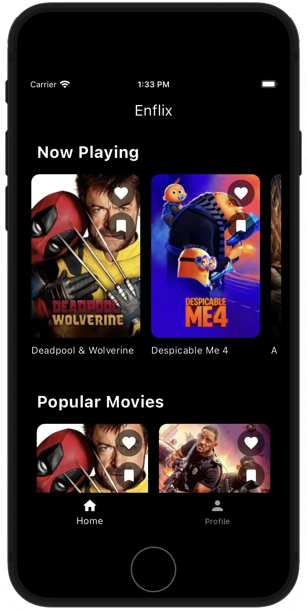
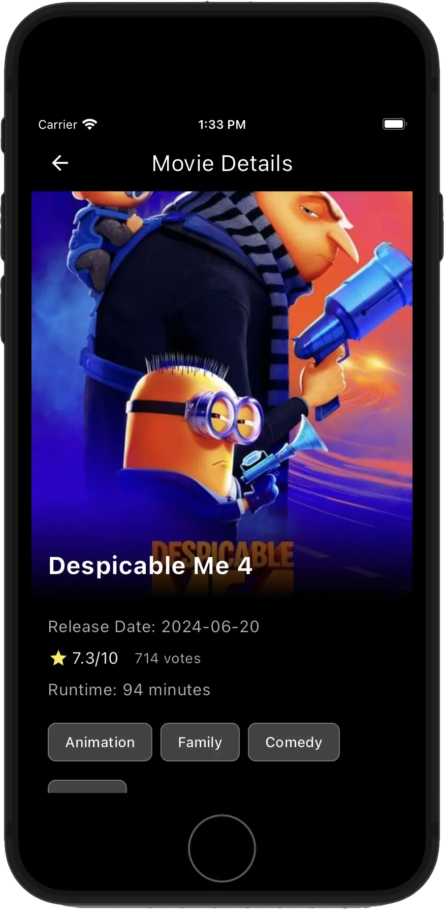
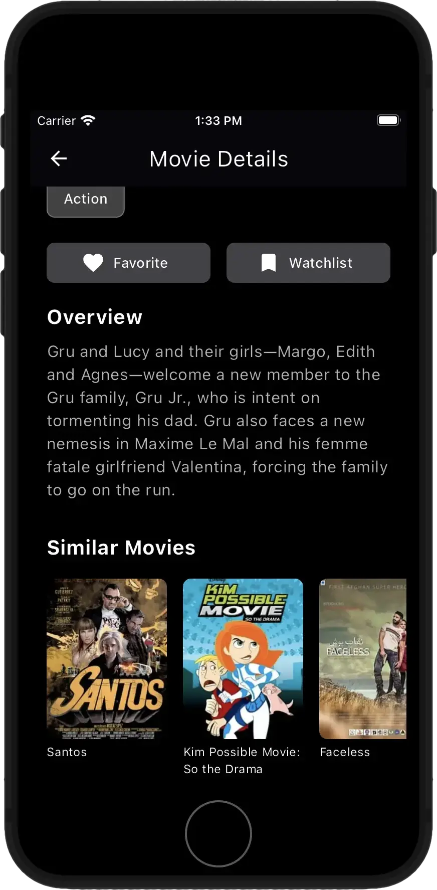
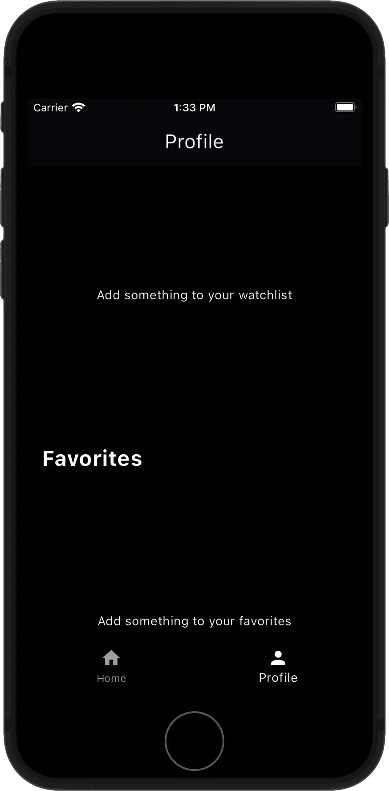
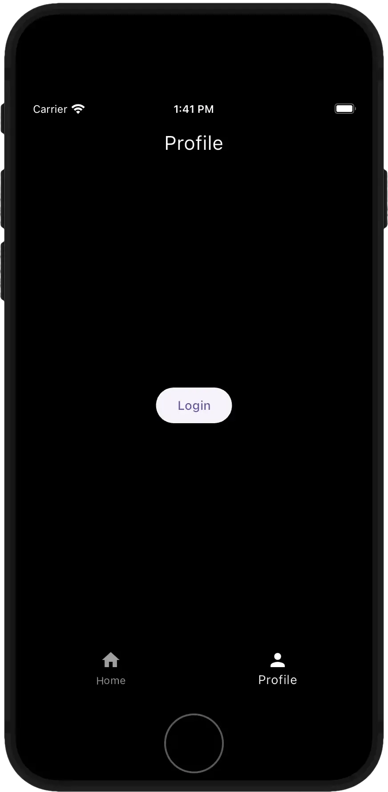
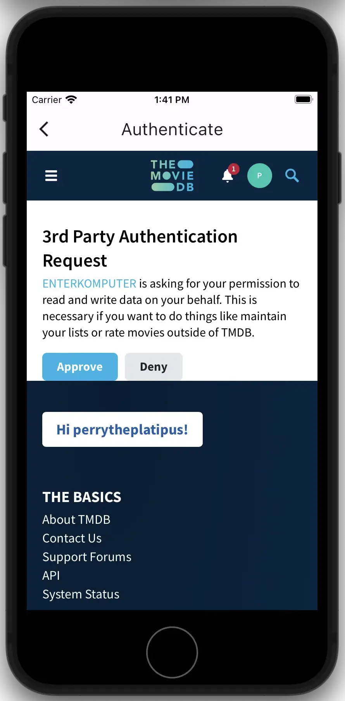
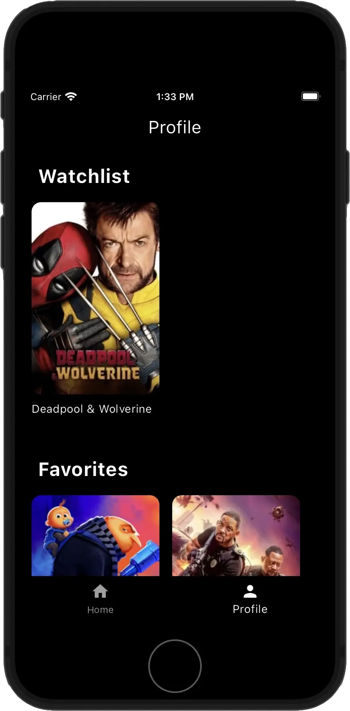

# Flutter TMDB App

This Flutter application interacts with The Movie Database (TMDB) API to provide users with movie information, authentication, and personalized features.

## Features

- TMDB API integration
- User authentication (TMDB auth)
- Movie listings:
  - Now Playing (limited to 6 movies)
  - Popular Movies (limited to 20 movies)
- Add movies to Watchlist
- Add movies to Favorites
- Movie details view
- Similar movie recommendations
- Image caching

## Screens

| Home Screen                           | Movie Details                             | Similar Movies                                  | User Profile (Empty)                                  |
| ------------------------------------- | ----------------------------------------- | ----------------------------------------------- | ----------------------------------------------------- |
|  |  |           |  |
| Browse popular and now playing movies | View detailed information about a movie   | Discover similar movies based on your selection | View your profile (when not logged in)                |

| Login Screen                            | Login WebView                               | User Profile (Filled)                                   |
| --------------------------------------- | ------------------------------------------- | ------------------------------------------------------- |
|  |  |  |
| Log in to your TMDB account             | Authenticate via TMDB's web interface       | View your watchlist and favorites (when logged in)      |

### User Profile

- [x] Shows Watchlist movies
- [x] Shows Favorite movies

### Home

- [x] Now Playing movies (limited to 6)
- [x] Popular movies (limited to 20)
- [x] Add to Watchlist functionality
- [x] Add to Favorites functionality
- [x] Image caching for offline viewing (using cached_network_image)

### Movie Details

- [x] Detailed information about a selected movie
- [x]  Similar movie recommendations based on genre

## Future Scope

- [ ] Region selection for localized content
- [ ] Additional TMDB API integrations
- [ ] Add decent auth

## Dependencies

```yaml
dependencies:
  flutter:
    sdk: flutter
  cupertino_icons: ^1.0.2
  http: ^1.2.0
  cached_network_image: ^3.3.0
  webview_flutter: ^4.5.0
  get: ^4.6.6
  logger: ^2.0.0
```

## Getting Started

1. Clone this repository
2. Run `flutter pub get` to install dependencies
3. Set up your TMDB API key 
   1. copy secret.dart.example to secret.dart
   ```
   cd lib/core/
   cp secret.dart.example secret.dart
   ```
   3. obtain your own API token and key
4. Run the app using `flutter run`

## Contributing

Contributions are welcome! Please feel free to submit a Pull Request.

## License

[License](LICENSE.txt)

## Acknowledgements

- [The Movie Database (TMDB)](https://www.themoviedb.org/) for providing the API
- All contributors to the project (currently only me lol)
